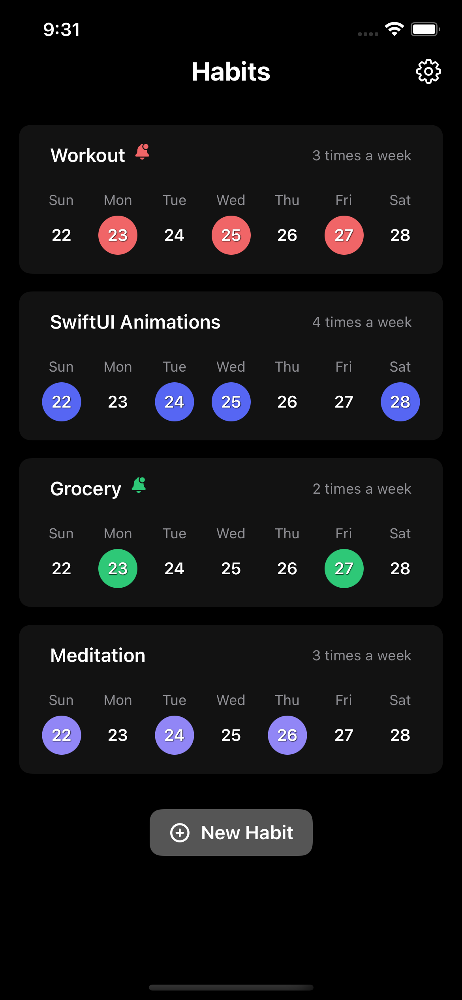
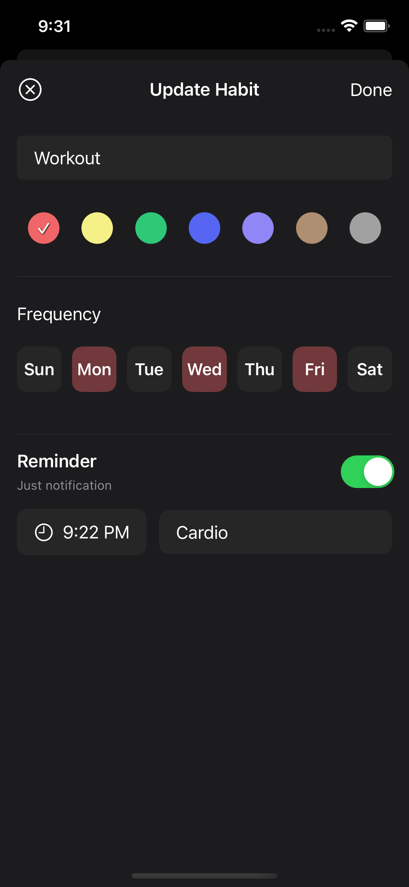
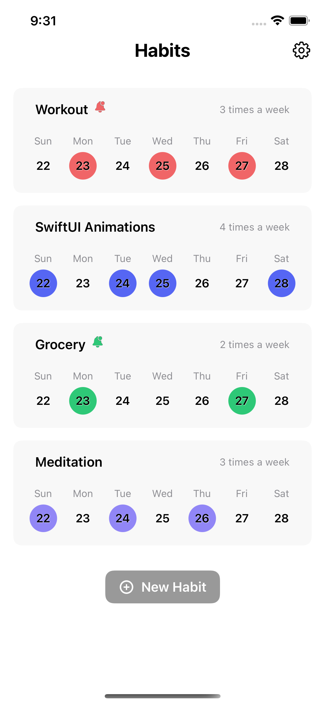
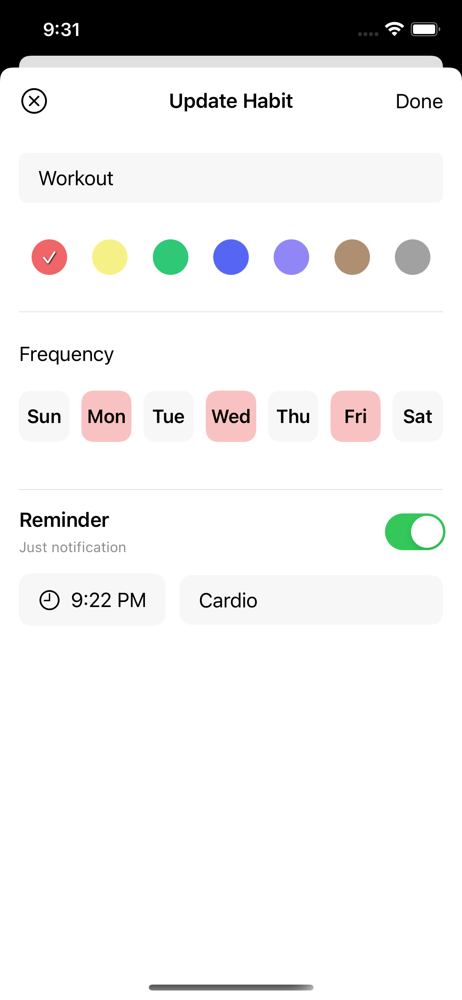

# HabitTracker-SwiftUI
 
In this SwiftUI project, you can create habits and add reminder to notify you. 
 
The following technologies/features are used:

* MVVM design pattern,
* Core Data,
* NotificationCenter,
* swipe to delete an item in VStack by using ViewModifier, 
* drag and drop to organize items in VStack and save the order to Core Data.

 
 

<table>
<thead>
   <tr>
        <th colspan="2">
Screenshots
</th>
  </tr>
</thead>
<tbody>
   <tr>
        <td>
          
        </td>
        <td>
          
        </td>
  </tr>
  <tr>
        <td>
          
        </td>
        <td>
          
        </td>
  </tr>
  <tr> 
     <th colspan="2">
     

        <b>Demo</b>

</th>
  </tr>
  <tr>
     <td colspan="2">
        

https://user-images.githubusercontent.com/37440706/169711770-f62e94ba-ac1e-4b11-bcbc-6f4862da46fc.mp4

  </tr>
</tbody>
</table>
